This tutorial explains how to create a `systemd` boot service on an Ubuntu GPU instance that waits until both the GPU driver and the Docker service are ready before automatically restarting a specified Docker container — avoiding startup failures caused by the driver or service not being ready yet.

This tutorial covers:

- Prerequisites (confirming the GPU environment, creating a test container)
- Creating the startup script
- Setting script execute permissions
- Creating the systemd boot service
- Reloading the systemd configuration
- Enabling the service to start on boot
- Testing the service manually
- Checking whether setup succeeded / checking service status

## Introduction to Systemd

Systemd is the init system on Linux — at boot, it's responsible for starting the various services in order.

`systemctl` is the tool used to issue commands to systemd: starting, stopping, or restarting a service, or checking a service's current status, are all done through `systemctl` talking to `systemd`.

This tutorial sets up a `systemd` boot service that:

- Runs with **root privileges**
- Waits for Ubuntu to fully boot
- Waits for the NVIDIA GPU driver to finish initializing (confirmed via `nvidia-smi`)
- Waits for the Docker service to finish starting
- Automatically runs: `docker restart myServer`

## Prerequisites (GPU Instance Specific — Check Before You Begin)

Before moving on to the steps below, confirm the following three items on your GPU instance:

**1. After starting a GPU instance, confirm that `nvidia-smi` displays GPU information correctly**

Why: the script later in this tutorial checks `nvidia-smi` to decide whether to continue, so you need to confirm the GPU and driver are installed correctly first. This tutorial uses `docker` and `systemctl` commands, which are currently only supported on VM-type instances.

- Click `Create New` to start creating an instance, search for Ubuntu, and select a VM-type machine. Choose an Ubuntu image and create the instance.

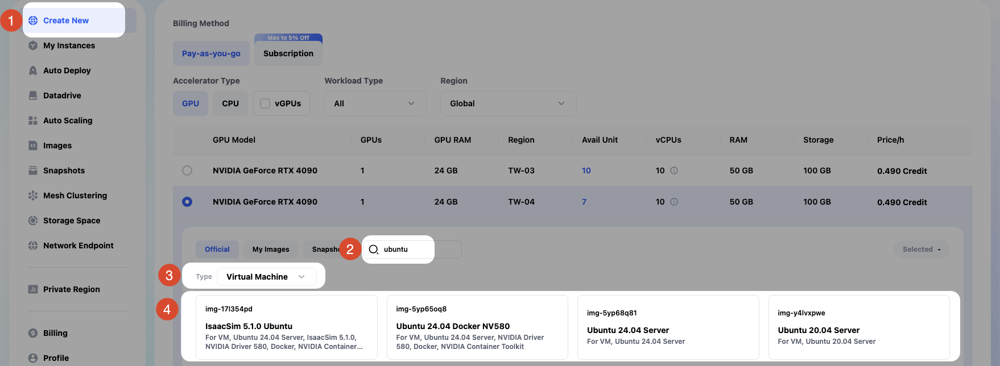

- Once the instance is running, on the instance page click `Access` > `SSH Port 22` > copy the `SSH Command` > and connect to the instance using `Password`.

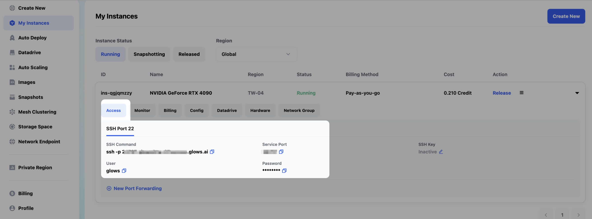

- After connecting to the instance, run **`nvidia-smi`** to confirm the GPU and driver are installed correctly.

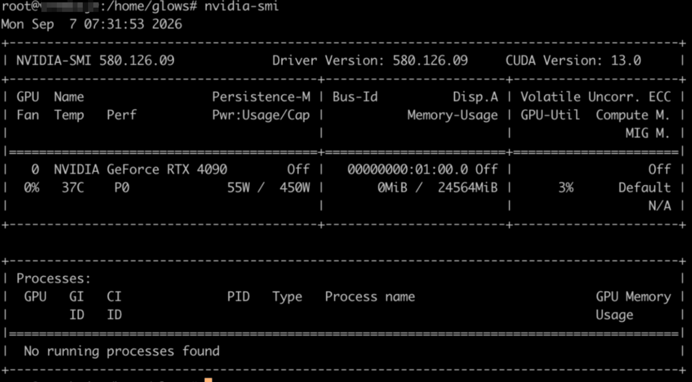

**2. Switch to the root user**

If your instance isn't already logged in as root, run `sudo su` to switch to the root user. This avoids later `docker`/`systemctl` commands failing due to insufficient permissions.

1. Before switching, the user is still `glows`, not `root`.

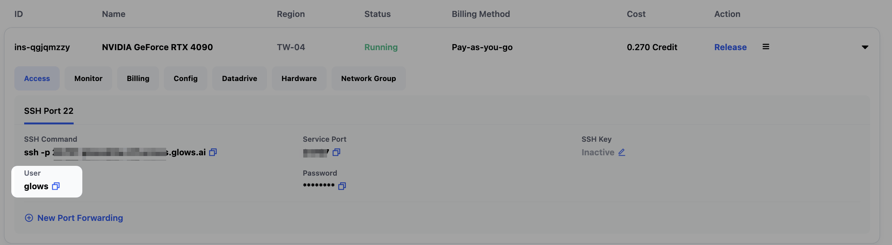

2. After running `sudo su`, you'll be asked for a password — get it from the instance details page under `Access` > `SSH Port 22` > `Password`.

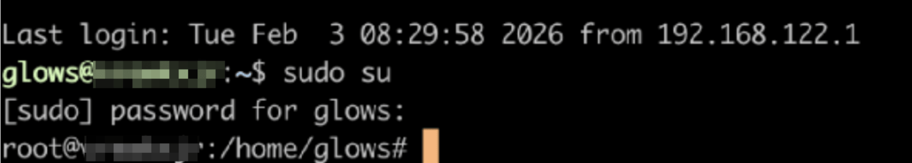

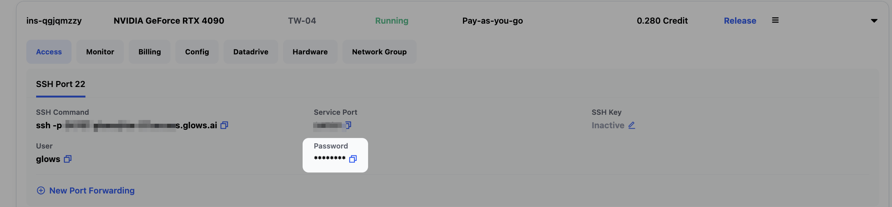

**3. Create the `myServer` (example name) container to be auto-restarted**

`docker restart` only works on containers that already exist. In this example, we use nginx to create a minimal server. If `myServer` doesn't exist yet on this machine, the boot script's `docker restart myServer` step will fail later.

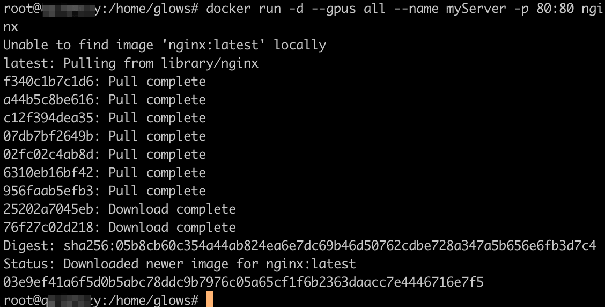

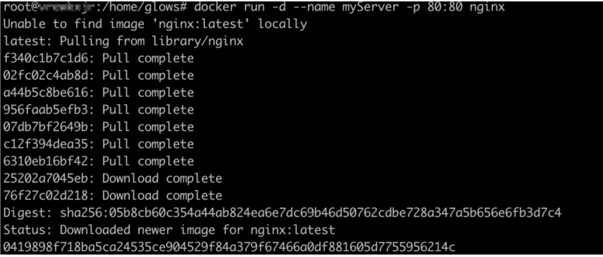

## 1. Create the Startup Script

Create the script file:

```bash
sudo nano /usr/local/bin/restart-myserver.sh
```

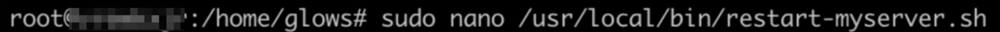

Add the following content:

```bash
#!/bin/bash

# Wait for the NVIDIA driver to finish initializing
echo "Waiting for the NVIDIA driver..."

until nvidia-smi >/dev/null 2>&1
do
    sleep 2
done

echo "NVIDIA driver is ready"

# Wait for the Docker service to finish starting
echo "Waiting for Docker to start..."

until systemctl is-active --quiet docker
do
    sleep 2
done

echo "Docker is ready"

# Restart the Docker container
echo "Restarting myServer..."

docker restart myServer

echo "myServer restarted"
```

> - `until nvidia-smi >/dev/null 2>&1; do sleep 2; done`: a polling loop that repeatedly checks `nvidia-smi` until the GPU driver is confirmed ready before continuing.
> - `until systemctl is-active --quiet docker; do sleep 2; done`: checks whether the Docker service has started.
> - `docker restart myServer`: the script's main purpose — restart the specified container.
> - **Execution flow: wait for the GPU driver -> wait for Docker to start -> restart the specified container** (`docker restart myServer`)

After editing, use:

```text
Ctrl + O
Enter
Ctrl + X
```

to save and exit the editor.

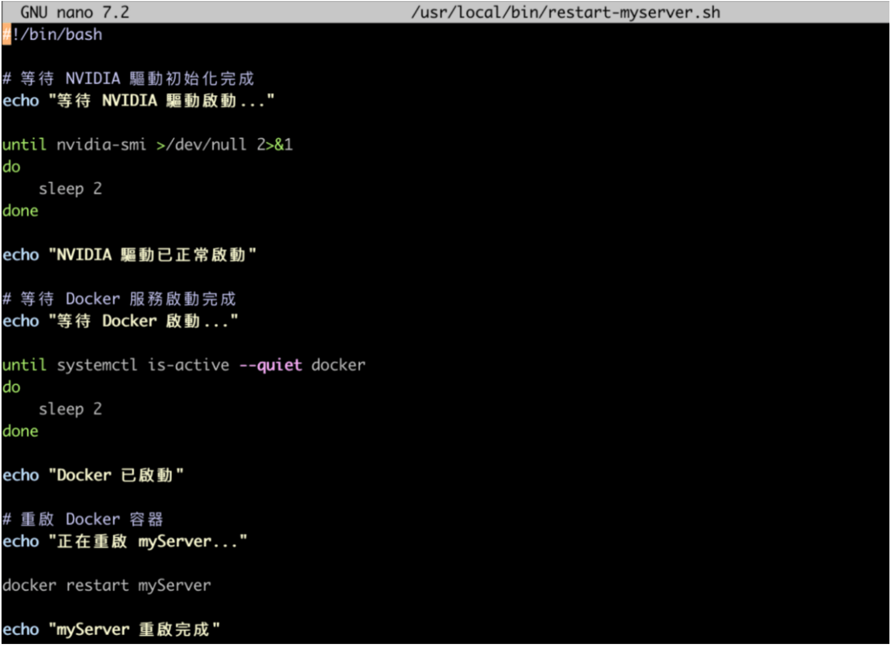

## 2. Set Script Execute Permissions

Run:

```bash
sudo chmod +x /usr/local/bin/restart-myserver.sh
```

> Newly created files on Linux are, by default, not executable — only readable and editable. `chmod +x` marks this script as executable, so it won't be rejected for insufficient permissions later when systemd (or you, manually) runs it. This command doesn't print any output.

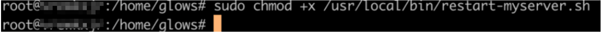

## 3. Create the systemd Boot Service

Create the service file:

```bash
sudo nano /etc/systemd/system/restart-myserver.service
```


Enter:

```text
[Unit]
Description=Restart myServer Docker container after NVIDIA initialization
After=network-online.target docker.service nvidia-persistenced.service
Wants=network-online.target docker.service

[Service]
Type=oneshot
ExecStart=/usr/local/bin/restart-myserver.sh
RemainAfterExit=yes
User=root

[Install]
WantedBy=multi-user.target
```

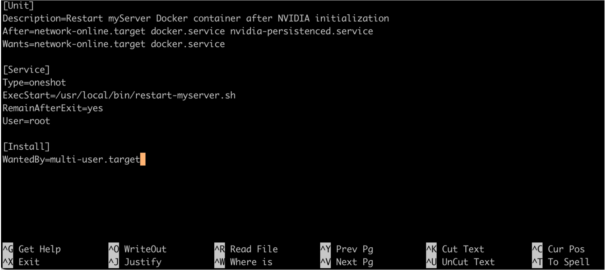

> - **[Unit]**:
>     - `Description`: a description of the service.
>     - `After`/`Wants`: specifies that the network, Docker, and NVIDIA services must be ready before this service starts.
> - **[Service]**:
>     - `Type=oneshot`: this service runs once and then finishes.
>     - `ExecStart`: the path to the script to run.
>     - `RemainAfterExit=yes`: keeps the service shown as active after it finishes, so a successful run can be verified (otherwise it would show as inactive).
>     - `User=root`: the commands in this script require root privileges.
> - **[Install]**:
>     - `WantedBy=multi-user.target` binds this service to start when the system boots into normal multi-user mode.

Save and exit.

## 4. Reload the systemd Configuration

Run:

```bash
sudo systemctl daemon-reload
```

> `daemon-reload` manually tells systemd, "a service configuration file has been added or changed — please reread it." Without running this, systemd will keep using the old configuration, or won't know this new service exists — later commands may fail to find the service, or apply outdated settings.


## 5. Enable the Service to Start on Boot

Run:

```bash
sudo systemctl enable restart-myserver.service
```

> `enable` registers this service in the boot startup list, so systemd will run it automatically on every reboot.

You should see something like:

```text
Created symlink /etc/systemd/system/multi-user.target.wants/restart-myserver.service
```

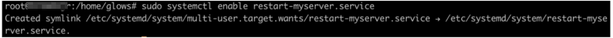

## 6. Test the Service Manually

You can test it right away without rebooting:

```bash
sudo systemctl start restart-myserver.service
```

> `enable` in the previous step doesn't run the service immediately, so `start` is used here to verify the script and the systemd service file are configured correctly.

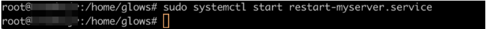

Check the execution log:

```bash
journalctl -u restart-myserver.service -f
```

A normal run looks like:

```text
Waiting for the NVIDIA driver...
NVIDIA driver is ready

Waiting for Docker to start...
Docker is ready

Restarting myServer...
myServer restarted
```

## Check Whether Setup Succeeded

Check whether it's enabled:

```bash
systemctl is-enabled restart-myserver.service
```

> If it returns `enabled`, setup is complete.

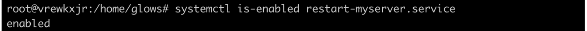

## Check Service Status

```bash
systemctl status restart-myserver.service
```

> `Active: active (exited)` means the service ran successfully.

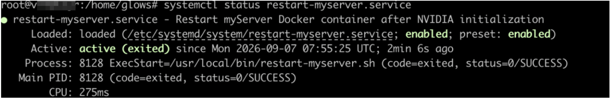

## Boot Sequence Overview

Once set up, the boot sequence is as follows:

```text
Ubuntu boots
    ↓
systemd starts
    ↓
Wait for network and Docker service
    ↓
Wait for NVIDIA driver to finish initializing
    ↓
Confirm nvidia-smi works
    ↓
Confirm Docker has started
    ↓
Run docker restart myServer
```

This avoids the following problems:

- The GPU driver hasn't loaded yet, causing CUDA containers to fail to start
- Docker has started, but the NVIDIA runtime isn't ready yet
- The boot process happens too quickly, causing container initialization errors

## Recommended For

- Ubuntu 20.04 / 22.04 / 24.04
- NVIDIA GPU hosts
- Docker + CUDA container environments
- AI inference servers, GPU servers, or any environment that needs services automatically restored after boot

## Contact Us

If you have any questions or suggestions while using Glows.ai, feel free to contact us via email, Discord, or Line.

**Email:** [support@glows.ai](mailto:support@glows.ai)

**Discord:** [https://discord.com/invite/glowsai](https://discord.com/invite/glowsai)

**Line:** [https://lin.ee/fHcoDgG](https://lin.ee/fHcoDgG)
