このチュートリアルでは、Glows.ai 上で Auto Deploy を使ってGPU ベースのローカルモデルをオンデマンドで起動し、常時稼働の Open WebUI インターフェースと接続する方法を解説します。これにより、「インターフェースは CPU で常時稼働、モデルは GPU でオンデマンド起動」というコスト効率の良いハイブリッド構成を構築できます。

このチュートリアルの内容は以下のとおりです。

- GPU インスタンスの Auto Deploy を設定する
- Auto Deploy で起動したローカルモデルが正常に動作しているか確認する
- Open WebUI インスタンスをデプロイする
- Open WebUI に Auto Deploy の接続を追加する
- 実際に会話をテストする

## Auto Deploy の概要

Auto Deploy は Glows.ai が提供するオンデマンドデプロイの仕組みで、リクエストが届いたときにのみインスタンスを自動起動して処理を行い、一定時間アイドル状態が続くと自動的に解放されます。トラフィックが不定期なインターフェースサービスと組み合わせるのに適しており、実際に推論が必要なときだけ高価な GPU リソースを占有します。

Open WebUI 自体は軽量なチャットインターフェースで、GPU を使わずに常時起動できます。外部 API 経由で、会話リクエストを Auto Deploy が起動する GPU モデルへ転送します。

それでは、Glows.ai 上でこのアーキテクチャの設定手順を実際に見ていきましょう。

## Auto Deploy を設定する

1. Glows.ai プラットフォームの左側メニューから **`Auto Deploy`** に入り、右上の **`New Deploy`** をクリックします。

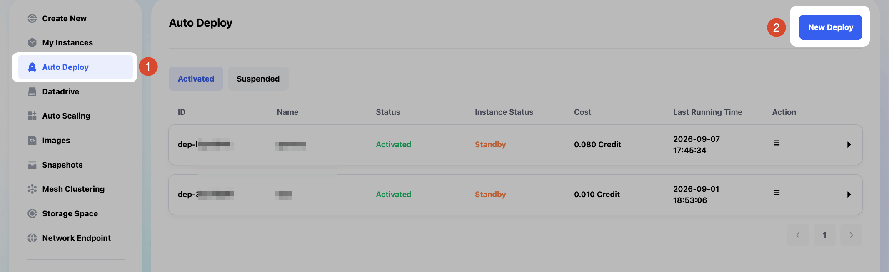

2. インスタンスの作成を開始します。GPU を選択し、モデルは **`NVIDIA GeForce RTX 4090`** を選択します。イメージは `Gemma4 31B Q4` モデルが同梱されたものを選択します。

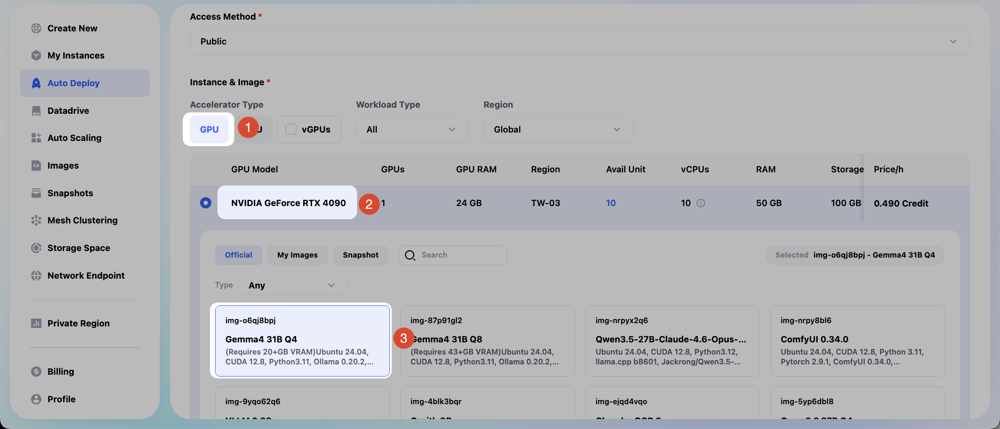

3. 下にスクロールし、Port（HTTP/HTTPS）欄に `11434`（Ollama サービスがデフォルトでリスンするポート）を入力します。`Confirm` をクリックして Auto Deploy を作成します。

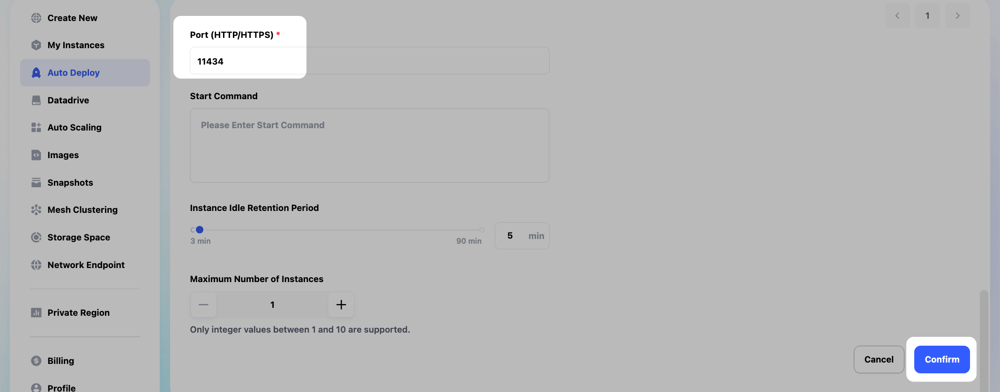

4. Auto Deploy の画面で、一覧から先ほど作成したインスタンスをクリックして展開すると、**URL** 欄に外部からアクセスできる固定アドレスが表示されます。この URL をコピーします。

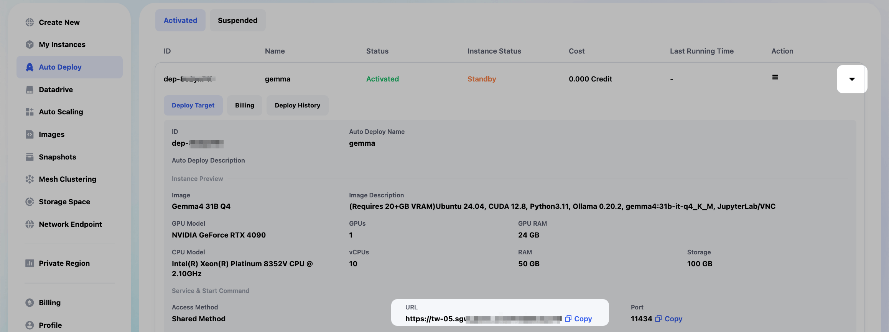

## Auto Deploy をテストする

1. Open WebUI に接続する前に、まずターミナルから直接 API をテストして、Auto Deploy が正しく設定されていることを確認することをお勧めします。

ターミナルで、チャット機能（Chat Completions API）が正常に動作するかを確認します。

以下を入力します。

```json
curl -X POST "あなたのAutoDeployURL/v1/chat/completions" \
  -H "Content-Type: application/json" \
  -d '{
    "model": "gemma4:31b-it-q4_K_M",
    "messages": [{"role": "user", "content": "hello"}]
  }'
```

画面のとおり、このコマンドで Auto Deploy によって起動されたインスタンス上のローカル AI モデルから正常に応答が返ってきます。

> 注意：初回呼び出しは少し時間がかかります。Auto Deploy 経由でリクエストを送信すると、そこから Glows.ai が GPU インスタンスを起動するため、起動には十数秒から 30 秒程度かかります。

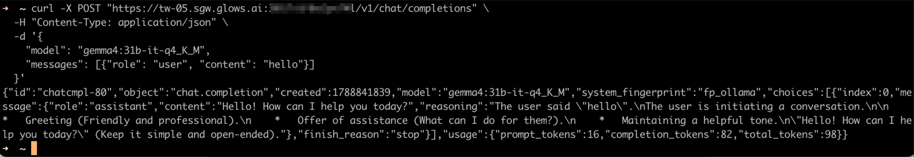

注意：`model` 欄に入力するモデル名は、本チュートリアルで使用しているイメージでは `gemma4:31b-it-q4_K_M` です。

本チュートリアルと異なるイメージのインスタンスを使用する場合、モデル名は異なります。先に `curl "あなたのAutoDeployURL/api/tags"` を実行して、正確なモデル名を取得することもできます。

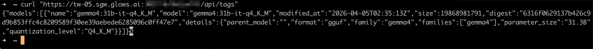

2. Glows.ai のインスタンス画面では、先ほどのコマンドによってインスタンスが Auto Deploy 経由で正常に起動したことを確認できます。

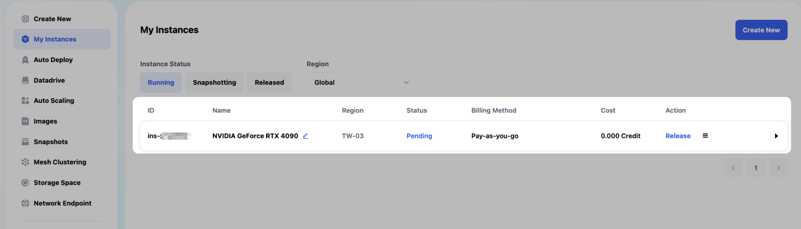

3. インスタンスが起動した後、新しいリクエストが来なければ、インスタンスは自動的に解放されます。Auto Deploy 作成時に、この自動解放までの時間を設定できます。


## Open WebUI でモデル接続を設定する

1. インスタンス作成画面で、Open WebUI が含まれたイメージを使ってインスタンスを新規作成します。検索欄に `open webui` と入力すると、Open WebUI のイメージをすぐに見つけられます。

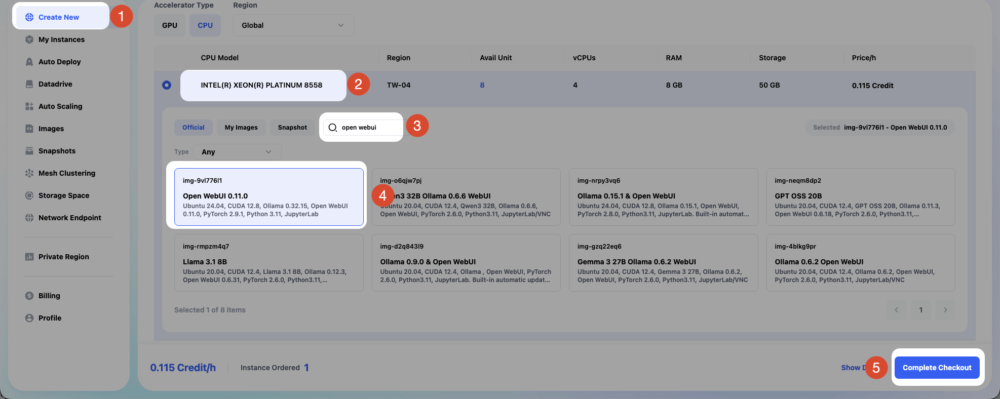

2. インスタンスが正常に起動したら、`Access` > `HTTP Port 8080` > `Open` を選択して Open WebUI の画面を開きます。

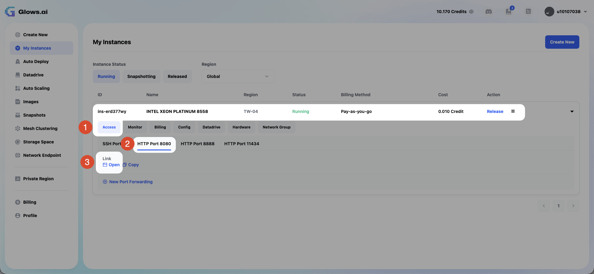

3. Open WebUI で `Workspace` > `Models` > `Create` をクリックし、モデルの作成を開始します。

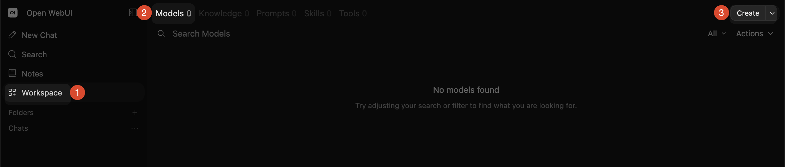

4. モデルメニューを開いたら、一覧の中から `Manage Connections` をクリックします。

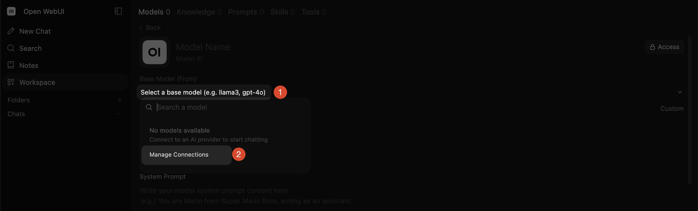

5. ポップアップが表示されるので、右側の `＋` をクリックして新しい接続の作成を開始します。

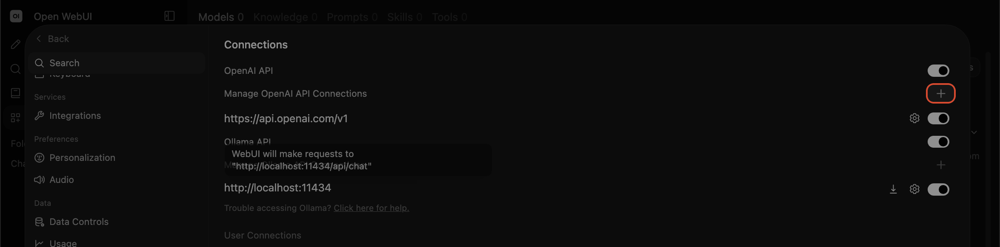

6. URL 欄に、先ほど Auto Deploy のページで取得した URL を貼り付け、末尾に `/v1` を追加します（例：`https://tw-05.sgw.glows.ai:0000/x/xxxxxxxx/v1`）。その後 Save をクリックします。（ポップアップ内の `Auth` 欄は空欄で構いません。Ollama はデフォルトで API キーを必要としないためです。）

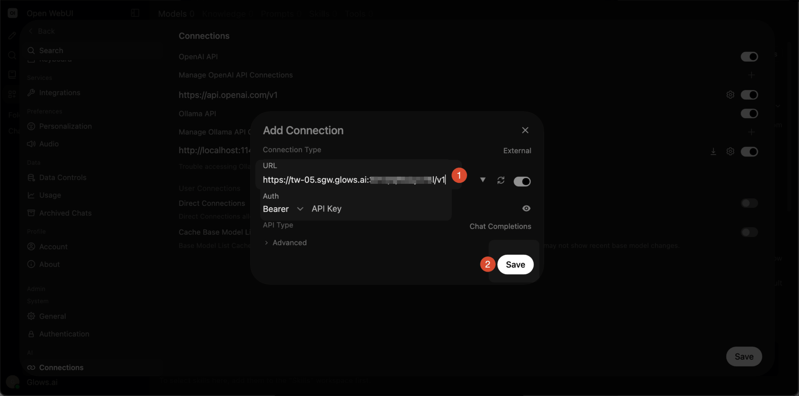

7. ポップアップのフォームが正常に保存されると、一覧に先ほど作成した新しい接続が表示されます。確認したら `Save` をクリックします。

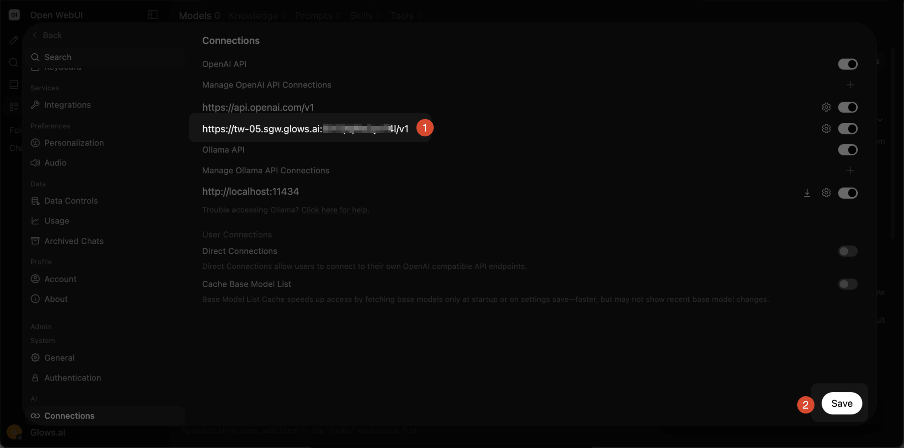

## 会話を始める

1. Open WebUI のメイン画面で `New Chat` をクリックし、新しい会話を開始します。入力欄の右側にあるモデル一覧をクリックし、先ほど作成したモデルを選択します。

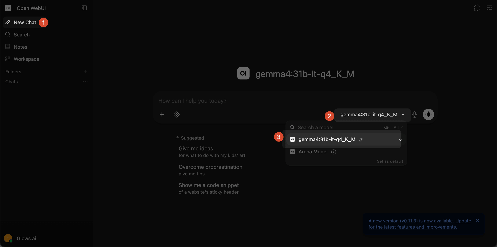

2. これにより Auto Deploy がトリガーされ、Glows.ai インスタンス上のローカル AI モデルから正常に応答が返ってきます。

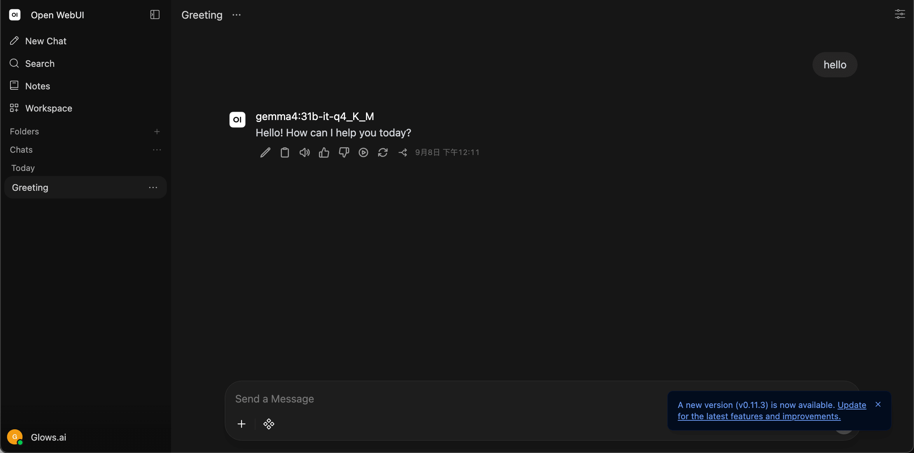

3. モデルの呼び出しに成功したことは、インスタンスが正常に起動したことを意味します。インスタンスが起動した後、新しいリクエストが来なければ、インスタンスは自動的に解放されます。Auto Deploy 作成時に、この自動解放までの時間を設定できます。

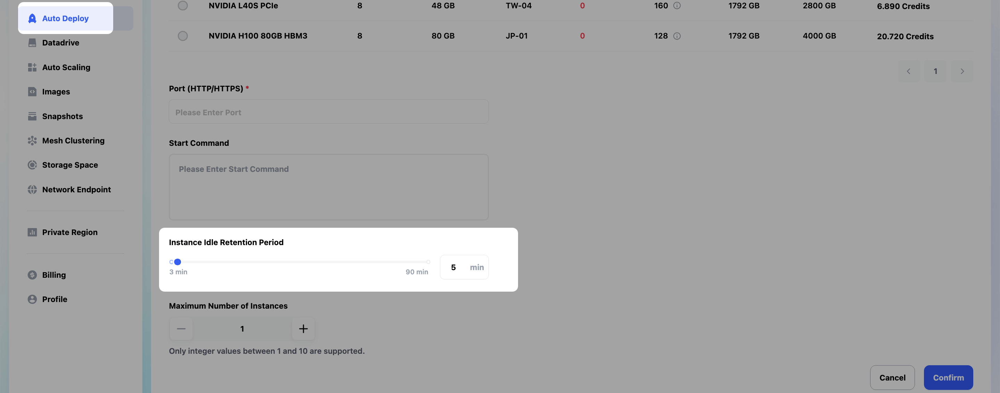

## お問い合わせ

Glows.ai の利用中に質問やご意見がある場合は、email、Discord、Line からお問い合わせください。

**Email:** [support@glows.ai](mailto:support@glows.ai)

**Discord:** [https://discord.com/invite/glowsai](https://discord.com/invite/glowsai)

**Line:** [https://lin.ee/fHcoDgG](https://lin.ee/fHcoDgG)
