本教程將教大家如何在 Windows 環境下安裝 Git Bash，並透過 SSH 金鑰連接 Glows.ai 上的 GPU 實例。

本教程包括以下內容：

- 安裝 Git Bash
- 建立 SSH Key
- 取得公鑰內容並上傳至 Glows.ai
- 透過 SSH Key 連線至 Glows.ai 實例

**Git Bash** 是 Windows 上的一款終端機工具，內建了 Git 版本控制工具與 SSH 用戶端，讓習慣 Linux/Mac 指令列操作的使用者，也能在 Windows 環境下使用熟悉的指令進行版本控制與 SSH 遠端連線。

在 Glows.ai 平台上，實例預設提供的 **SSH Command** 是密碼登入方式，每次連線都需要手動貼上密碼；透過本教學設定 SSH Key 後，系統會改用金鑰自動驗證身份，連線時無需再輸入密碼，也更加安全便利。

接著讓我們透過步驟化的示範，一起在 Glows.ai 上體驗。

## 安裝 Git Bash

1. 前往 Git 官方下載頁面 [`git-scm.com/install/windows`](https://git-scm.com/install/windows)，下載 Git for Windows 安裝程式。下載完成後執行安裝程式。安裝完成後，在開始選單搜尋並開啟 **Git Bash**。

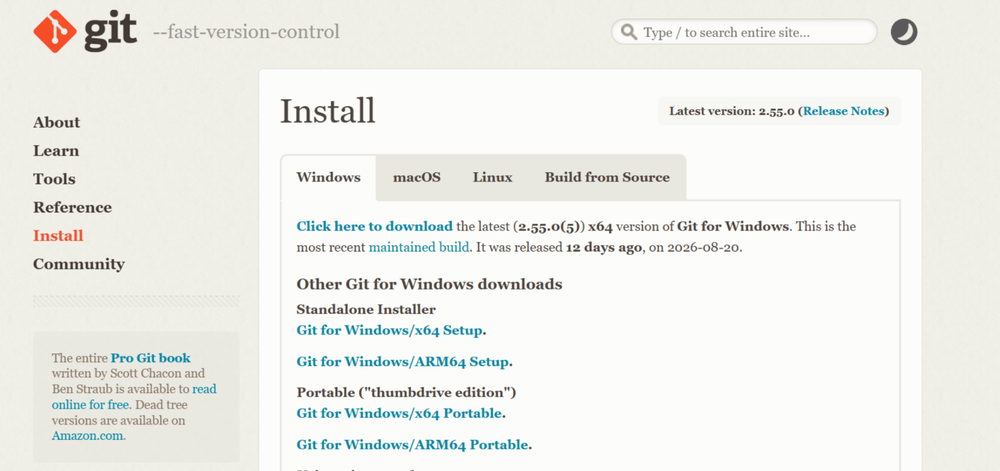

- 在桌面點擊右鍵，選擇 **Git Bash** 開啟應用程式。

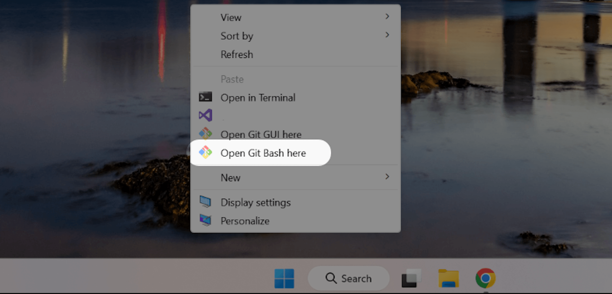

## 建立 SSH Key

1. 開啟 Git Bash，輸入以下指令建立一組 SSH 金鑰（`-C` 後面的信箱使用您自己的信箱地址，用來標註這把金鑰）：

```bash
ssh-keygen -t ed25519 -C "your_email@example.com"
```

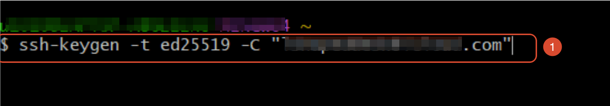

2. 系統會詢問要將金鑰儲存在哪個路徑，直接按 Enter 使用預設路徑（`~/.ssh/id_ed25519`）即可。

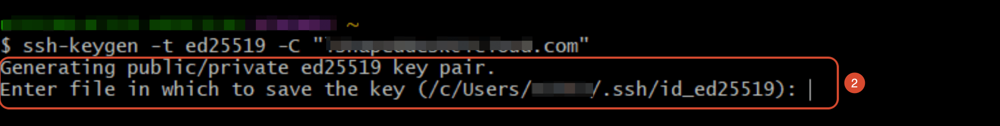

3. 系統會詢問是否設定密碼保護（passphrase），可直接按 Enter 略過。

4. 要求再輸入一次密碼確認，因為上一步我們沒有設定密碼，這裡按 Enter 帶過即可。若上一步驟有輸入自訂密碼，這時需再輸入一次確認。

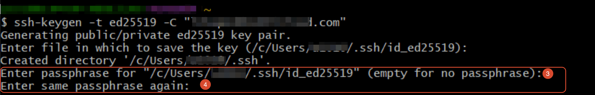

5. 完成後畫面會顯示金鑰已儲存的路徑（`id_ed25519` 為私鑰、`id_ed25519.pub` 為公鑰）與金鑰指紋，代表 SSH Key 金鑰對已建立成功。下一步我們將取得公鑰內容，並上傳至 Glows.ai。

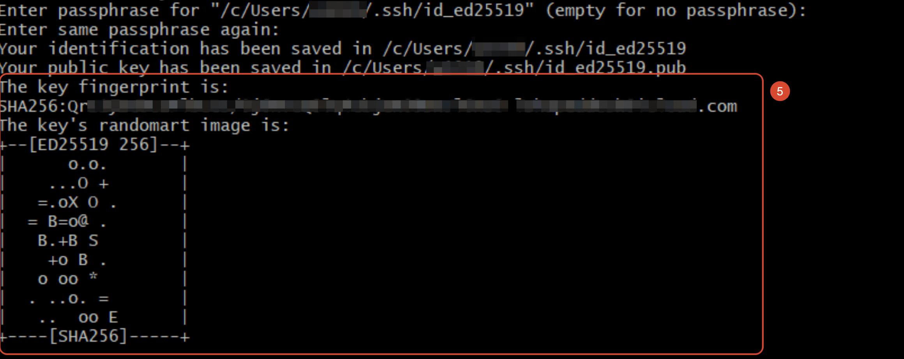

### 建立 SSH Key 常見問題

**Windows 使用者名稱為中文或特殊字元時的路徑錯誤：**

當我們輸入 `ssh-keygen -t ed25519 -C "your_email@example.com"` 以建立金鑰後，系統會詢問存放路徑，接著我們按下 Enter 使用預設路徑。

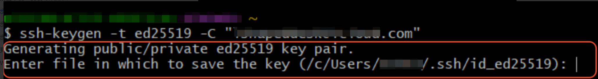

這時產生錯誤訊息：`Could not create directory '/c/Users/xxx/.ssh'`、`Saving key ... failed: No such file or directory`。原因是 Git Bash 在存取 `~/.ssh` 路徑時可能因編碼問題失敗，這是 Git Bash 處理中文路徑的已知限制。

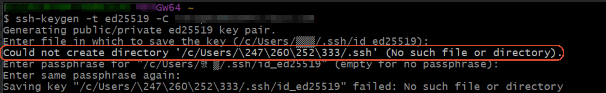

**解決方式**：執行 `ssh-keygen` 後，在 `Enter file in which to save the key` 提示時**不要**直接按 Enter，改為手動輸入一個純英文路徑，例如：

`/c/ssh/id_ed25519`

## 取得公鑰內容並上傳到 Glows.ai

1. **在 Git Bash 輸入：**

```bash
cat ~/.ssh/id_ed25519.pub
```

執行後會輸出公鑰內容，請將整段輸出完整複製起來。

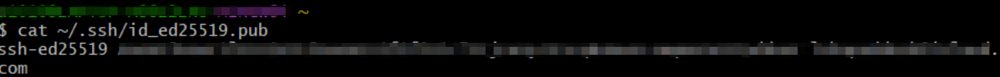

2. 在 [Glows.ai](http://glows.ai) 主畫面左側欄位中點擊 `Profile` > SSH keys > 點擊 `New SSH Key`。

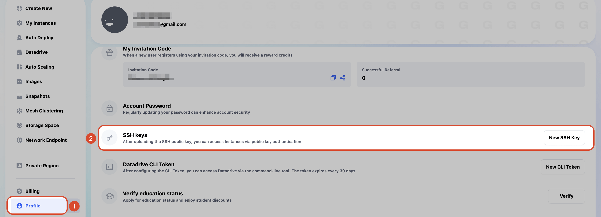

3. 將剛剛複製的公鑰內容貼入欄位中，點擊 **`Update key`** 完成新增。需等待幾分鐘生效。

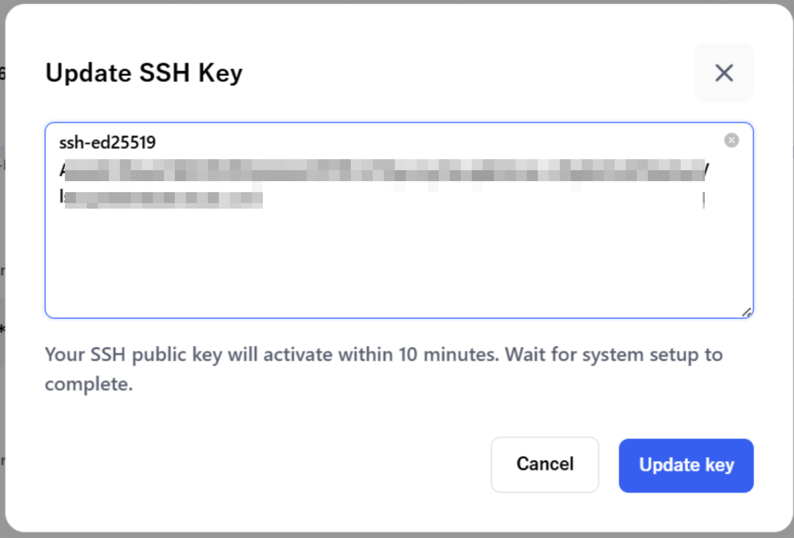

## 透過 Git Bash 及 SSH Key 存取實例

1. 上一個步驟設定完成後，開啟實例後，點擊 `SSH port22`，您可以看到欄位 SSH Key 會變成 `Active`（設定完後需等待幾分鐘從 `Inactive` 變為 `Active`），我們可以開始進行登入。

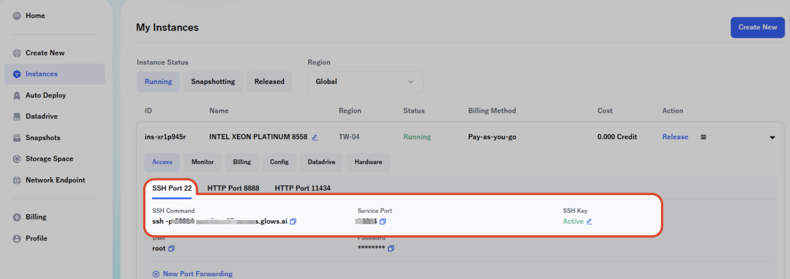

2. 開啟 **Git Bash** 並輸入連線指令：

```bash
ssh -p <Service Port> -i <私鑰路徑> root@<Access URL>
```

若依本教學使用預設路徑建立金鑰，則 `<私鑰路徑>` 為 `~/.ssh/id_ed25519`。

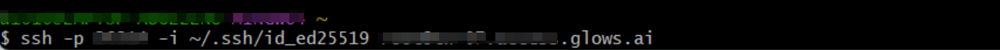

3. 若是**第一次**連線到此主機，Git Bash 會顯示以下提示，詢問是否信任該主機的金鑰指紋（這是 SSH 用來防止連到偽造伺服器的安全機制）。輸入 `yes` 並按下 Enter 即可繼續連線。此主機資訊會被記錄下來，之後再次連線同一台實例就不會再看到這個提示。

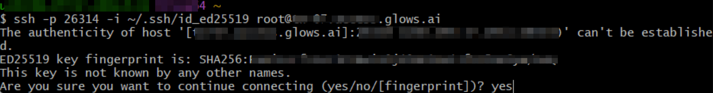

4. 成功連線。

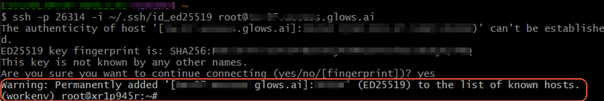

## 聯絡我們

使用 Glows.ai 時若有問題或建議，可透過 email、Discord 或 Line 聯絡我們。

**Email:** [support@glows.ai](mailto:support@glows.ai)

**Discord:** [https://discord.com/invite/glowsai](https://discord.com/invite/glowsai)

**Line:** [https://lin.ee/fHcoDgG](https://lin.ee/fHcoDgG)
